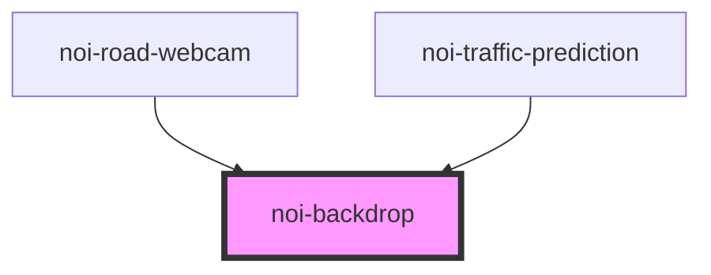

<!--
SPDX-FileCopyrightText: NOI Techpark <digital@noi.bz.it>

SPDX-License-Identifier: CC0-1.0
-->

# noi-backdrop

<!-- Auto Generated Below -->

## Overview

(INTERNAL) Backdrop component.

## Properties

| Property | Attribute | Description                                                                                                                                          | Type      | Default |
| -------- | --------- | ---------------------------------------------------------------------------------------------------------------------------------------------------- | --------- | ------- |
| `hidden` | `hidden`  | Removing backdrop from DOM sometime can cause blink during layout recalculation. 'hidden' can be used to hide the backdrop without removing from DOM | `boolean` | `false` |

## Events

| Event           | Description                              | Type                |
| --------------- | ---------------------------------------- | ------------------- |
| `backdropClick` | Emitted when user clicks on the backdrop | `CustomEvent<void>` |

## CSS Custom Properties

| Name                | Description     |
| ------------------- | --------------- |
| `--backdrop-color`  | backdrop color  |
| `--backdrop-filter` | backdrop filter |

## Dependencies

### Used by

 - [noi-road-webcam](../../road-webcam)
 - [noi-traffic-prediction](../../traffic-prediction)

### Graph

----------------------------------------------

*Built with [StencilJS](https://stenciljs.com/)*
