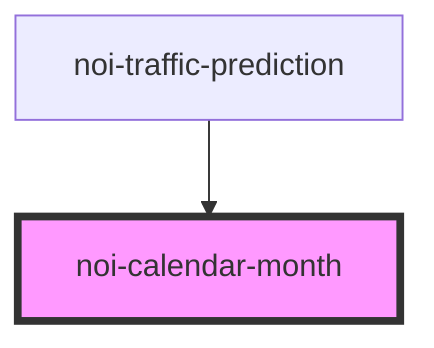

<!--
SPDX-FileCopyrightText: NOI Techpark <digital@noi.bz.it>

SPDX-License-Identifier: CC0-1.0
-->

# noi-calendar-month

<!-- Auto Generated Below -->

## Overview

(INTERNAL) Calendar component.

It's not encapsulated, so the styles can be applied outside of the component.

## Properties

| Property       | Attribute  | Description            | Type                             | Default      |
| -------------- | ---------- | ---------------------- | -------------------------------- | ------------ |
| `itemRenderer` | --         | Cell render function   | `(d: CalendarDayContext) => any` | `undefined`  |
| `language`     | `language` | Language for day names | `string`                         | `'en'`       |
| `viewDate`     | --         | calendar view date     | `Date`                           | `new Date()` |

## Dependencies

### Used by

 - [noi-traffic-prediction](../../traffic-prediction)

### Graph

----------------------------------------------

*Built with [StencilJS](https://stenciljs.com/)*
