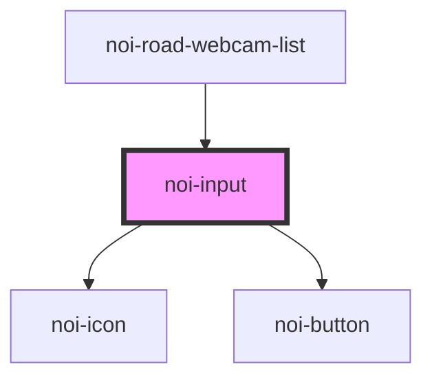

<!--
SPDX-FileCopyrightText: NOI Techpark <digital@noi.bz.it>

SPDX-License-Identifier: CC0-1.0
-->

# noi-input

<!-- Auto Generated Below -->

## Overview

(INTERNAL) render an input with prefix and clear button

Prefix are hardcoded to 'search' icon for now.

## Properties

| Property      | Attribute     | Description       | Type     | Default     |
| ------------- | ------------- | ----------------- | -------- | ----------- |
| `placeholder` | `placeholder` | Input placeholder | `string` | `undefined` |

## Events

| Event         | Description                   | Type                  |
| ------------- | ----------------------------- | --------------------- |
| `valueChange` | Emitted when value is changed | `CustomEvent<string>` |

## Shadow Parts

| Part             | Description        |
| ---------------- | ------------------ |
| `"clear-btn"`    | clear input button |
| `"input-native"` | Native input       |
| `"input-prefix"` | prefix component   |

## CSS Custom Properties

| Name                 | Description      |
| -------------------- | ---------------- |
| `--color-background` | Background color |
| `--color-text`       | Text color       |

## Dependencies

### Used by

 - [noi-road-webcam-list](../../road-webcam/partials/road-webcam-list)

### Depends on

- [noi-icon](../icon)
- [noi-button](../button)

### Graph

----------------------------------------------

*Built with [StencilJS](https://stenciljs.com/)*
