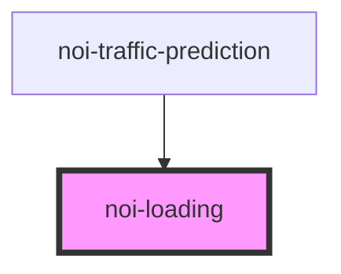

<!--
SPDX-FileCopyrightText: NOI Techpark <digital@noi.bz.it>

SPDX-License-Identifier: CC0-1.0
-->

# noi-loading

<!-- Auto Generated Below -->

## Overview

(INTERNAL) render loading indicator over the content.
This allows to render content with empty data hidden behind the loader,
so when data is loaded there would be no resize onf the content

## Properties

| Property    | Attribute    | Description       | Type      | Default |
| ----------- | ------------ | ----------------- | --------- | ------- |
| `isLoading` | `is-loading` | Input placeholder | `boolean` | `false` |

## Slots

| Slot        | Description                    |
| ----------- | ------------------------------ |
|             | main content slot              |
| `"loading"` | slot to show loading indicator |

## Dependencies

### Used by

 - [noi-traffic-prediction](../../traffic-prediction)

### Graph

----------------------------------------------

*Built with [StencilJS](https://stenciljs.com/)*
