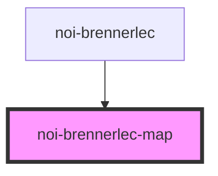

<!--
SPDX-FileCopyrightText: NOI Techpark <digital@noi.bz.it>

SPDX-License-Identifier: CC0-1.0
-->

# noi-brennerlec-map

<!-- Auto Generated Below -->

## Overview

(INTERNAL) render leaflet map

## Events

| Event      | Description                                             | Type               |
| ---------- | ------------------------------------------------------- | ------------------ |
| `mapReady` | Emitted when map is initialized and ready to draw on it | `CustomEvent<Map>` |

## CSS Custom Properties

| Name           | Description |
| -------------- | ----------- |
| `--map-filter` | Map filter  |

## Dependencies

### Used by

 - [noi-brennerlec](../../road-webcam)

### Graph

----------------------------------------------

*Built with [StencilJS](https://stenciljs.com/)*
