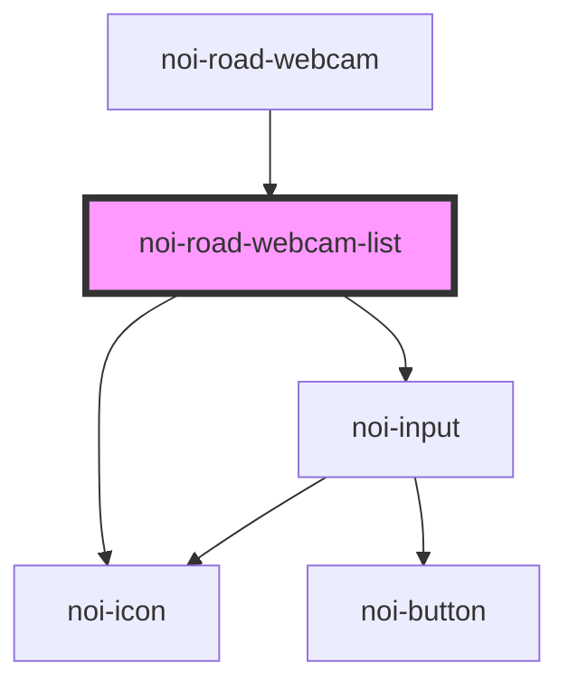

<!--
SPDX-FileCopyrightText: NOI Techpark <digital@noi.bz.it>

SPDX-License-Identifier: CC0-1.0
-->

# noi-road-webcam-list

<!-- Auto Generated Below -->

## Overview

(INTERNAL) part of 'noi-road-webcam'

## Properties

| Property     | Attribute     | Description | Type                                          | Default     |
| ------------ | ------------- | ----------- | --------------------------------------------- | ----------- |
| `idSelected` | `id-selected` |             | `string`                                      | `null`      |
| `layout`     | `layout`      |             | `"auto" \| "desktop" \| "mobile" \| "tablet"` | `undefined` |
| `webcamArr`  | --            |             | `WebcamInfoShort[]`                           | `null`      |

## Events

| Event       | Description | Type                           |
| ----------- | ----------- | ------------------------------ |
| `itemClick` |             | `CustomEvent<WebcamInfoShort>` |

## Dependencies

### Used by

 - [noi-road-webcam](../..)

### Depends on

- [noi-icon](../../../blocks/icon)
- [noi-input](../../../blocks/input)

### Graph

----------------------------------------------

*Built with [StencilJS](https://stenciljs.com/)*
