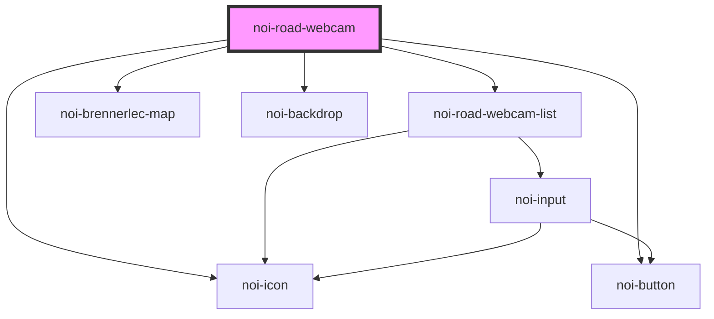

<!--
SPDX-FileCopyrightText: NOI Techpark <digital@noi.bz.it>

SPDX-License-Identifier: CC0-1.0
-->

# noi-road-webcam

<!-- Auto Generated Below -->

## Properties

| Property   | Attribute  | Description | Type                                          | Default  |
| ---------- | ---------- | ----------- | --------------------------------------------- | -------- |
| `language` | `language` |             | `string`                                      | `'en'`   |
| `layout`   | `layout`   |             | `"auto" \| "desktop" \| "mobile" \| "tablet"` | `'auto'` |

## Shadow Parts

| Part      | Description |
| --------- | ----------- |
| `"list"`  |             |
| `"map"`   |             |
| `"popup"` |             |

## CSS Custom Properties

| Name                  | Description                 |
| --------------------- | --------------------------- |
| `--color-background`  | Background color            |
| `--color-marker`      | Map marker color            |
| `--color-primary`     | Primary color               |
| `--color-primary-rgb` | Primary color in RGB format |
| `--color-secondary`   | Secondary color             |
| `--color-text`        | Text color                  |

## Dependencies

### Depends on

- [noi-road-webcam-list](./partials/road-webcam-list)
- [noi-brennerlec-map](../blocks/map)
- [noi-backdrop](../blocks/backdrop)
- [noi-button](../blocks/button)
- [noi-icon](../blocks/icon)

### Graph

----------------------------------------------

*Built with [StencilJS](https://stenciljs.com/)*
