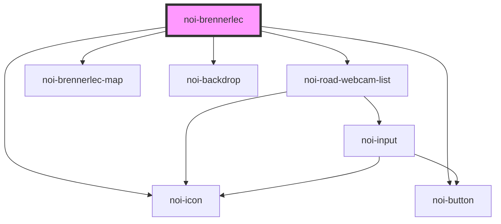

<!--
SPDX-FileCopyrightText: NOI Techpark <digital@noi.bz.it>

SPDX-License-Identifier: CC0-1.0
-->

# noi-road-webcam

<!-- Auto Generated Below -->

## Overview

Road webcameras component

## Properties

| Property         | Attribute         | Description          | Type                                          | Default  |
| ---------------- | ----------------- | -------------------- | --------------------------------------------- | -------- |
| `language`       | `language`        | Language             | `string`                                      | `'en'`   |
| `layout`         | `layout`          | Layout appearance    | `"auto" \| "desktop" \| "mobile" \| "tablet"` | `'auto'` |
| `reloadInterval` | `reload-interval` | Data reload interval | `number`                                      | `60000`  |

## Methods

### `refreshData() => Promise<void>`

Reload camera data (basically, it's images)

#### Returns

Type: `Promise<void>`

## Shadow Parts

| Part      | Description  |
| --------- | ------------ |
| `"list"`  | camera list  |
| `"map"`   | Map          |
| `"popup"` | Popup dialog |

## CSS Custom Properties

| Name                    | Description                 |
| ----------------------- | --------------------------- |
| `--color-background`    | Background color            |
| `--color-primary`       | Primary color               |
| `--color-primary-rgb`   | Primary color in RGB format |
| `--color-secondary`     | Secondary color             |
| `--color-text`          | Text color                  |
| `--map-marker-color`    | Map marker color            |
| `--map-marker-color-bg` | Map marker background       |
| `--scrollbar-bg`        | Scrollbar background color  |
| `--scrollbar-color`     | Scrollbar thumb color       |

## Dependencies

### Depends on

- [noi-road-webcam-list](./partials/road-webcam-list)
- [noi-brennerlec-map](../blocks/map)
- [noi-backdrop](../blocks/backdrop)
- [noi-button](../blocks/button)
- [noi-icon](../blocks/icon)

### Graph

----------------------------------------------

*Built with [StencilJS](https://stenciljs.com/)*
