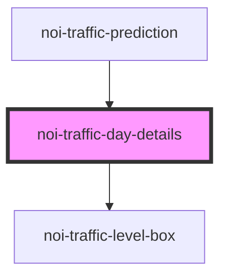

<!--
SPDX-FileCopyrightText: NOI Techpark <digital@noi.bz.it>

SPDX-License-Identifier: CC0-1.0
-->

# noi-traffic-day-details

<!-- Auto Generated Below -->

## Overview

(INTERNAL) part of 'noi-traffic-prediction'

## Properties

| Property    | Attribute   | Description | Type                                                                                                                  | Default     |
| ----------- | ----------- | ----------- | --------------------------------------------------------------------------------------------------------------------- | ----------- |
| `details`   | --          |             | `{ q1: TrafficPredictionLevel; q2: TrafficPredictionLevel; q3: TrafficPredictionLevel; q4: TrafficPredictionLevel; }` | `undefined` |
| `direction` | `direction` |             | `"north" \| "south"`                                                                                                  | `undefined` |

## Dependencies

### Used by

 - [noi-traffic-prediction](../..)

### Depends on

- [noi-traffic-level-box](../level-box)

### Graph

----------------------------------------------

*Built with [StencilJS](https://stenciljs.com/)*
