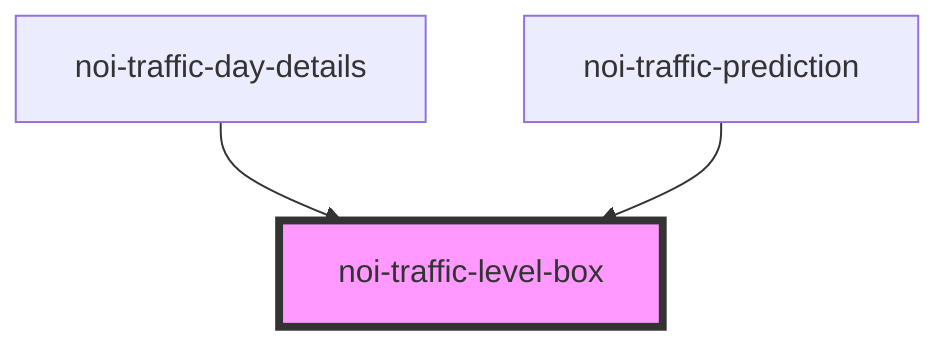

<!--
SPDX-FileCopyrightText: NOI Techpark <digital@noi.bz.it>

SPDX-License-Identifier: CC0-1.0
-->

# noi-traffic-level-box

<!-- Auto Generated Below -->

## Overview

(INTERNAL) part of 'noi-traffic-prediction'

## Properties

| Property | Attribute | Description | Type                                             | Default     |
| -------- | --------- | ----------- | ------------------------------------------------ | ----------- |
| `level`  | `level`   |             | `"critical" \| "heavy" \| "regular" \| "severe"` | `undefined` |

## Dependencies

### Used by

 - [noi-traffic-day-details](../day-details)
 - [noi-traffic-prediction](../..)

### Graph

----------------------------------------------

*Built with [StencilJS](https://stenciljs.com/)*
