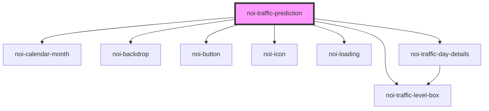

<!--
SPDX-FileCopyrightText: NOI Techpark <digital@noi.bz.it>

SPDX-License-Identifier: CC0-1.0
-->

# noi-traffic-prediction

<!-- Auto Generated Below -->

## Properties

| Property   | Attribute  | Description | Type                                          | Default      |
|------------|------------|-------------|-----------------------------------------------|--------------|
| `language` | `language` |             | `string`                                      | `'en'`       |
| `layout`   | `layout`   |             | `"auto" \| "desktop" \| "mobile" \| "tablet"` | `'auto'`     |
| `location` | `location` |             | `"Bolzano" \| "Brennero" \| "Verona"`         | `undefined`  |
| `viewDate` | --         |             | `Date`                                        | `new Date()` |

## Methods

### `changeViewMonth(change: number) => Promise<void>`

#### Parameters

| Name     | Type     | Description |
|----------|----------|-------------|
| `change` | `number` |             |

#### Returns

Type: `Promise<void>`

### `resetToCurrentMonth() => Promise<void>`

#### Returns

Type: `Promise<void>`

### `selectDay(day: Date | null) => Promise<void>`

#### Parameters

| Name  | Type   | Description |
|-------|--------|-------------|
| `day` | `Date` |             |

#### Returns

Type: `Promise<void>`

## Shadow Parts

| Part         | Description |
|--------------|-------------|
| `"calendar"` |             |
| `"footer"`   |             |
| `"popup"`    |             |
| `"title"`    |             |

## CSS Custom Properties

| Name                             | Description                    |
|----------------------------------|--------------------------------|
| `--busy-box-size`                | size of the box                |
| `--color-background`             | Background color               |
| `--color-background-shade`       | Background dark color          |
| `--color-border`                 | Border color                   |
| `--color-busy-critical`          | Severe traffic color           |
| `--color-busy-critical-contrast` | Severe traffic contrast color  |
| `--color-busy-heavy`             | Severe traffic color           |
| `--color-busy-heavy-contrast`    | Severe traffic contrast color  |
| `--color-busy-regular`           | Regular traffic color          |
| `--color-busy-regular-contrast`  | Regular traffic contrast color |
| `--color-busy-severe`            | Severe traffic color           |
| `--color-busy-severe-contrast`   | Severe traffic contrast color  |
| `--color-footer`                 | Footer color                   |
| `--color-footer-contrast`        | Footer contrast color          |
| `--color-primary`                | Primary color                  |
| `--color-primary-rgb`            | Primary color in RGB format    |
| `--color-secondary`              | Secondary color                |
| `--color-secondary-rgb`          | Secondary color in RGB format  |
| `--color-text`                   | Text color                     |

## Dependencies

### Depends on

- [noi-calendar-month](../blocks/calendar-month)
- [noi-backdrop](../blocks/backdrop)
- [noi-button](../blocks/button)
- [noi-traffic-level-box](./partials/level-box)
- [noi-icon](../blocks/icon)
- [noi-loading](../blocks/loading)
- [noi-traffic-day-details](./partials/day-details)

### Graph

----------------------------------------------

*Built with [StencilJS](https://stenciljs.com/)*
